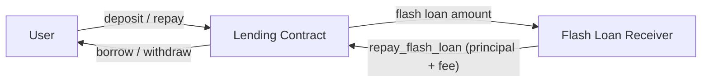

# StellarLend Lending Contract

A secure, efficient lending protocol built on Soroban that allows users to deposit collateral, borrow against it, repay debt, and participate in liquidations. Flash loans and emergency lifecycle controls are also available.

> **Documentation generation note**: this file is maintained by hand and must be
> kept in sync with `stellar-lend/contracts/lending/src/lib.rs`. After any
> change to a `pub fn` in `lib.rs`, update this file and
> `docs/interface_quick_reference.md` in the same PR. Run
> `cargo test -p stellarlend-lending` to verify no regressions.

---

## Features

- **Collateralized Borrowing**: Users deposit collateral and borrow up to the configured ceiling.
- **Interest Accrual**: Debt grows continuously based on a fixed APR expressed in basis points.
- **Risk Management**: Protocol-level debt ceilings, deposit caps, and a health-factor–based liquidation mechanism.
- **Flash Loans**: Single-transaction loans with configurable fees; callers must implement an `on_flash_loan` callback.
- **Emergency Lifecycle**: `Normal → Shutdown → Recovery → Normal` state machine controlled by the admin or guardian.
- **Two-Step Admin Transfer**: Admin handoff requires both `propose_admin` and `accept_admin` to prevent lockouts.
- **Arithmetic Safety**: All mutations use `checked_*` arithmetic; overflows return `LendingError::Overflow`.
- **Persistent TTL Management**: Collateral and debt entries have their TTL extended on every read or write to prevent archival.

---

## Building

```bash
cargo build --target wasm32-unknown-unknown --release
```

## Testing

```bash
cargo test -p stellarlend-lending
```

---

## Contract Interface

The table below reflects the **shipping** surface of `src/lib.rs` as of this branch. Functions marked **🔮 Planned** do not exist yet.

### Initialization

| Function | Signature | Auth | Description |
|---|---|---|---|
| `initialize` | `(env, admin: Address)` | — | One-time setup; sets admin and initial `EmergencyState::Normal`. Reverts if already initialized. |
| `get_admin` | `(env) → Address` | — | Returns the current admin address. |
| `propose_admin` | `(env, new_admin: Address)` | current admin | Step 1 of two-step admin transfer. Stores the proposed address. |
| `accept_admin` | `(env)` | proposed admin | Step 2: accepts the role committed by `propose_admin`. |

### User Operations

| Function | Signature | Auth | Returns | Description |
|---|---|---|---|---|
| `deposit` | `(env, user: Address, amount: i128) → i128` | `user` | New collateral balance | Adds `amount` to the user's collateral. Enforces deposit cap. Blocked during Shutdown. |
| `withdraw` | `(env, user: Address, amount: i128) → i128` | `user` | New collateral balance | Removes `amount` from the user's collateral. Only allowed in Normal and Recovery states. |
| `borrow` | `(env, user: Address, amount: i128) → Result<i128, LendingError>` | `user` | Updated debt principal | Increases user debt; enforces `min_borrow` and protocol debt ceiling. Blocked during Shutdown/Recovery. |
| `repay` | `(env, user: Address, amount: i128) → i128` | `user` | Remaining debt principal | Reduces user debt with interest accrued up to the current timestamp. Allowed in Normal and Recovery. |
| `liquidate` | `(env, liquidator: Address, borrower: Address, amount: i128) → Result<i128, Error>` | `liquidator` | Actual debt repaid | Repays up to 50% of an undercollateralized borrower's debt and seizes proportional collateral (+ 10% bonus). Reverts if position is healthy (`hf >= 10000`). |

### Flash Loans

| Function | Signature | Auth | Description |
|---|---|---|---|
| `flash_loan` | `(env, receiver: Address, asset: Address, amount: i128, params: Bytes)` | `receiver` | Transfers `amount` to `receiver`, calls `on_flash_loan(initiator, asset, amount, fee, params)`, then verifies full repayment including fee. |
| `repay_flash_loan` | `(env, asset: Address, amount: i128)` | invoker | Called **by the receiver contract** inside the `on_flash_loan` callback to return principal + fee. |

> **Flash loan fee**: controlled by `DataKey::FlashFeeBps` (default 5 bps = 0.05%). Currently settable only by direct storage mutation; a public setter is planned.

### View Functions

| Function | Signature | Returns | Description |
|---|---|---|---|
| `get_position` | `(env, user: Address) → PositionSummary` | `{ collateral: i128, debt: i128, health_factor: i128 }` | Returns collateral balance, effective debt (principal + accrued interest), and health factor (`col * 8000 / debt`; `1_000_000` when debt is zero). Extends TTL on read. |
| `get_debt_position` | `(env, user: Address) → DebtPosition` | `{ principal: i128, last_accrual: u64 }` | Raw debt state; useful for debugging or off-chain interest simulation. Extends TTL on read. |
| `get_min_borrow` | `(env) → i128` | `i128` | Returns the current minimum borrow amount (default `0`). |

### Admin & Risk Controls

| Function | Signature | Auth | Description |
|---|---|---|---|
| `set_min_borrow` | `(env, min_borrow: i128) → Result<(), LendingError>` | admin | Sets the minimum amount required to open or increase a borrow. |
| `set_debt_ceiling` | `(env, ceiling: i128) → Result<(), LendingError>` | admin | Sets the maximum total protocol debt. |
| `set_emergency_state` | `(env, new_state: EmergencyState)` | admin or guardian | Transitions between `Normal`, `Shutdown`, and `Recovery`. Emits `EmergencyStateChanged` event. |

### Emergency State Machine

```
Normal ──► Shutdown ──► Recovery ──► Normal
```

| State | Deposit | Borrow | Repay | Withdraw |
|---|---|---|---|---|
| `Normal` | ✅ | ✅ | ✅ | ✅ |
| `Shutdown` | ❌ | ❌ | ❌ | ❌ |
| `Recovery` | ❌ | ❌ | ✅ | ✅ |

### Error Reference

| Variant | Code | Description |
|---|---|---|
| `LendingError::BelowMinimumBorrow` | 1008 | Borrow amount is below the protocol minimum. |
| `LendingError::NotInitialized` | 1009 | Contract has not been initialized. |
| `LendingError::AlreadyInitialized` | 1010 | `initialize` called on an already-live contract. |
| `LendingError::DebtCeilingExceeded` | 2001 | Borrow would exceed the global debt ceiling. |
| `LendingError::DepositCapExceeded` | 2002 | Deposit would exceed the total deposit cap. |
| `LendingError::Overflow` | 2003 | Checked arithmetic overflow during the operation. |
| `Error::PositionHealthy` | 2004 | Liquidation rejected — health factor is sufficient. |

---

## 🔮 Planned Features

The functions listed below appear in older documentation but are **not yet implemented** in `src/lib.rs`. They are tracked for future milestones.

| Function | Notes |
|---|---|
| `set_oracle(env, admin, oracle)` | Price feed integration required for multi-asset health factor. |
| `set_pause(env, admin, pause_type, paused)` | Granular per-operation pausing (currently only global via `set_emergency_state`). |
| `set_guardian(env, admin, guardian)` | Dedicated setter for the guardian role (currently set directly in storage). |
| `set_liquidation_threshold_bps(env, admin, bps)` | Configurable liquidation threshold (currently hardcoded at 8000 BPS). |
| `set_close_factor_bps(env, admin, bps)` | Configurable close factor (currently hardcoded at 5000 BPS). |
| `get_health_factor(env, user)` | Convenience view (health factor is embedded in `get_position` today). |
| `get_collateral_value(env, user)` | USD-denominated collateral value (requires oracle). |
| `get_debt_value(env, user)` | USD-denominated debt value (requires oracle). |
| `get_max_liquidatable_amount(env, user)` | Convenience helper for liquidators. |
| `get_emergency_state(env)` | Public view for current lifecycle state (today exposed only via events). |
| `deposit_collateral(env, user, asset, amount)` | Multi-asset collateral support. |
| `upgrade_init / upgrade_propose / upgrade_approve / upgrade_execute` | Multisig upgrade governance. |
| `data_store_init / data_save / data_load / data_backup / data_restore` | Persistent data-store management helpers. |

---

## Token Transfer Flows



---

## Security & Trust Boundaries

### Authorization & Access Control
- **Admin**: Manages risk parameters, emergency state, and admin handoff.
- **Guardian**: Optionally stored at `DataKey::Guardian`; falls back to admin if not set. Authorized to call `set_emergency_state`.
- **User**: `deposit`, `withdraw`, `borrow`, `repay` each call `user.require_auth()`.
- **Liquidator**: `liquidate` calls `liquidator.require_auth()`.

### Execution Safety
- **Reentrancy**: Flash loans set `DataKey::FlashActive = true` before the external call and clear it after. `deposit`, `withdraw`, and `repay` panic if the guard is active.
- **Arithmetic Integrity**: All storage mutations use `checked_add` / `checked_sub`; overflows return `LendingError::Overflow` or panic with an informative message.
- **Multi-User Isolation**: Storage keys include the user `Address` (e.g., `DataKey::Collateral(user)`), guaranteeing strict per-address namespacing — verified by `test_multi_user_isolation` in `src/lib.rs`.

---

## Documentation

- [Interface Quick Reference](../../../../docs/interface_quick_reference.md) — compact, integrator-focused function table.
- [Storage Layout](../../../../docs/storage.md) — persistent key schema and TTL policy.
- [Developer Glossary](../../../../docs/glossary.md) — key protocol terms and numeric scales.

## License

See repository root for license information.
